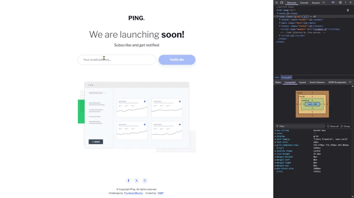

# Frontend Mentor - Ping coming soon page solution

This is a solution to the [Ping coming soon page challenge on Frontend Mentor](https://www.frontendmentor.io/challenges/ping-single-column-coming-soon-page-5cadd051fec04111f7b848da). Frontend Mentor challenges help you improve your coding skills by building realistic projects. 

**Table of contents**

- [The challenge](#the-challenge-)
- [Screenshots](#screenshots-)
- [Links](#links-)
- [Built with](#built-with-️)
- [Useful resources](#useful-resources-)
- [Author](#author-)

## The challenge 📌

Users should be able to:

🎯 View the optimal layout for the site depending on their device's screen size

🎯 See hover states for all interactive elements on the page
- Submit their email address using an `input` field
- Receive an error message when the `form` is submitted if:
	- The `input` field is empty. The message for this error should say *"Whoops! It looks like you forgot to add your email"*
	- The email address is not formatted correctly (i.e. a correct email address should have this structure: `name@host.tld`). The message for this error should say *"Please provide a valid email address"*

## Screenshots 📸

## Links 🔗

[Live site URL here](https://mendezpvi.github.io/fem-ping-coming-soon-page/) ↗️

## Built with 🛠️

✅ Semantic **HTML5 markup**

✅ **CSS custom properties**

✅ **Flexbox** and **Grid**

✅ **Dialog element** (`<dialog>`) with custom backdrop

✅ **Vanilla JavaScript** modules (`import/export`)

✅ **Form validation** with `ValidityState`

✅ **Dynamic rendering** of social icons with JavaScript

## Useful resources 🌎

📺 [Minor CSS tweaks to improve forms](https://youtu.be/awNYtIAu6pI?si=1DEc8OT_YG55GhY_) - by @KevinPowell

📺 [How to set custom error messages for your HTML forms](https://youtu.be/h5qqmE83Tes?si=nopojtOlBaaJS9S5) - by @KevinPowell

## Author 🔰

✨ Frontend Mentor - [@mendezpvi](https://www.frontendmentor.io/profile/mendezpvi)
